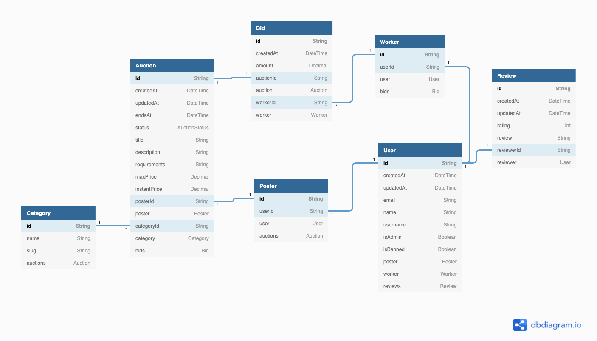

# Schmarket

## Table of Contents
* Objective
* Architecture Overview
* * DB Schema
* * Express.js Prototype
* * Backend application
* * Frontend application
* * User Authentication
* * Missing Screws
* Tools Used
* Installation

## Objective
Create an application accodring to the [requirements](requirements.docx)

## Architecture Overview

For this project I have chosen to use all new to me tools to produce a more modern application. For this I've selected [Prisma ORM](https://www.prisma.io/) coupled with [Next.js](https://nextjs.org/) frameworks.

I've decided against using a something like [strapi](https://strapi.io/) assuming this would constitute cheating on the assignment. However in the real world scenario these applications/frameworks are much better positioned for a rapid site buildout since they already come pre-packaged with all the necessary features, such as ACL, CRUD API, GraphQL, Admin UI, image resizer, etc.

### DB Schema

I have first prototyped DB schema in the [dbdiagram.io](https://dbdiagram.io/d) first, and then rewrote it as a Prisma schema. Due to time constraints I have not had a chance to set up additional indexes which would be necessary for production performance. For the same reason I've opted not to use images. 



Next, I've used [Synth](https://www.getsynth.com/) to generate seed data, with a little help from [generatedata.com](https://generatedata.com/generator) for long form text. After creating the seed schema and using it numerous times, I came to conclusion that next time I would do it differently, relying more on nesting rather than on separate schemas. This way it would provide dataset with safer relationships. As I was scaling up the amount of data generated I've ran into a number of errors, some of which I've addressed by adjusting the schema, while others by reducing number of generated rows...

I've implemented aucion expiration using `MySQL Event Scheduler`, which allowed to neatly fit the event in the migration schema and ensure that seed data will be correctly updated. 

### Express.js Prototype

After creating the DB schema and seeding it, I have used Express.js to prototype queries along with API routes and to test constraints using Postman. The prototype is available in the [app.js](app.js)

### Frontend Application

Once I had most queries in place, I've moved on to building out the frontend. Due to the nature of how my Express.js prototype returns data, it did not fit as a proper API backend, since it would require a lot more tuning and splitting. Instead I have opted to use `PrismaClient` directly from `Next.js` "pages". This is not how I would approach an application if I were to have more time to properly architect it, however it seemed sufficient to begin forming the look of the site. 

I have chosen not to use any premade themes, but found a few samples to draw inspiration from. I've always wanted to build a minimalistic site with a look similar to [Instagram](https://www.instapaper.com/p/bthdonohue/folder/3576872/engineering-management?r=1), and this seemed to be like a good match. In addition to that, I've found a [minimalistic job board](https://jobs.lever.co/ionicpartners/) that seemed to visually fit what I was looking for.

Most marketplace sites have a very prominent search field. I've built the wiring for it, but ran out of time to properly position the search field itself in the header. The search routes work and do a basic text search. In a real product a specialized engine such as Solr would be a better fit.

### Backend Application

In the ideal world, I'd like to have the backend service completely decoupled from the frontend, and have it comsumed via GraphQL and/or REST API. It would create a better separation of concerns as well as would allow to further shield the backend from the outside world. It would also allow to abstract DB lookups together with search engine filtering behind the scenes. 

For a true headless application we'd also need a proper caching layer in front of it, such as Varnish.

### User Authentication

I've limited authentication to a basic login with only a username in order to enable logged in/logged out states for some of the operations. Obviously, a real application would require a more robust ACL system.

### Missing Screws

- custom indexes on the tables
- isWinner flag on the Bids and a trigger to flip it
- "Buy Now" button 
- search form
- reviews and stars
- images
- user profile pages listing their auctions and winning bigs, showcasing their work
- admin

## Tools used

- [MySQL](https://www.mysql.com/) 8
- [dbdiagram.io](https://dbdiagram.io/d) - data modeling
- [Prisma](https://www.prisma.io/) - ORM and data modeling
- [Synth](https://www.getsynth.com/) - Data generator
- [generatedata.com](https://generatedata.com/generator) - Long text data generator
- [Express](https://expressjs.com/) - Node.js server/router framework (used for prototyping)
- [Next.js](https://nextjs.org/) - Frontend rendering framework
- [Tailwind CSS](https://tailwindcss.com/) - CSS framework 

## Installation

```bash
mkdir data
docker compose up -d
npm install -D
npx prisma generate
npx prisma migrate dev
npx prisma migrate reset
npm run dev
```

You can also regenerate seed data using the following command:

```bash
synth generate synth/ > prisma/seed.json
```